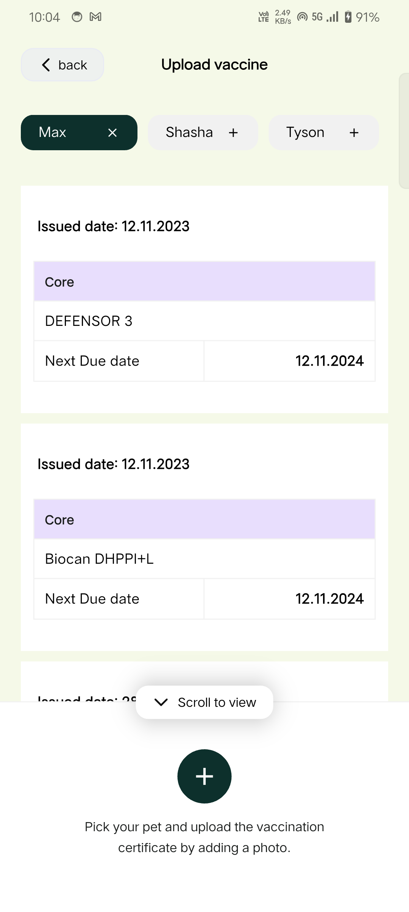

# Calico Assignment

## Assignment Overview
This application was developed as part of a design assignment to create a pixel-perfect, high-quality Flutter UI for managing pet vaccine verifications. The goal was to build a mobile interface that is not only functional but also visually appealing and user-friendly.

## Key Features
- **Upload Vaccine Verification**: A dedicated screen for users to easily upload vaccine documents for their pets.
- **Pet Selection**: An intuitive pet selector widget that allows users to choose which pet the record belongs to.
- **Modern UI Design**: The app features a clean, modern aesthetic using the Poppins font, custom card layouts, and smooth interactions.
- **User Experience**: Focused on a seamless user flow, ensuring that key actions like uploading and selecting pets are straightforward.

## How it Works
1. **Select a Pet**: Users can toggle between their pets (e.g., "Sneezy") to associate the vaccine record with the correct animal.
2. **Choose Vaccine Type**: Users select the specific vaccine type from the available options.
3. **Upload Document**: A clear call-to-action area allows users to browse and upload the necessary verification files.
4. **Submit**: Once all details are filled, the user can submit the verification request.
